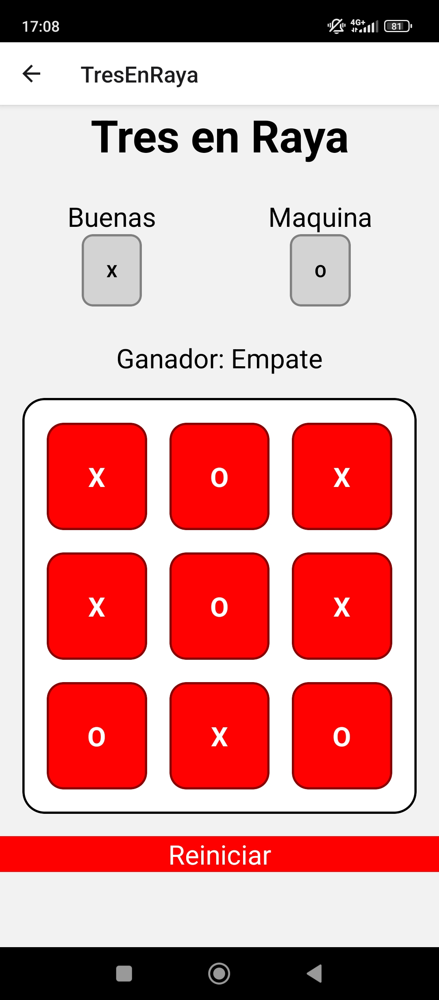

# TicTacToe-Spanish

## Rubén Abreu González

    

This is a Tic-Tac-Toe app where you can play online with friends or offline against the computer. You can also watch other players' games and check your match history.

The server is built with **Spring Boot (Java)**, and the client is made with **React Native (Android)**. The client updates the game information by **pulling data from the API**. The app is simple, fun, and easy to use!
